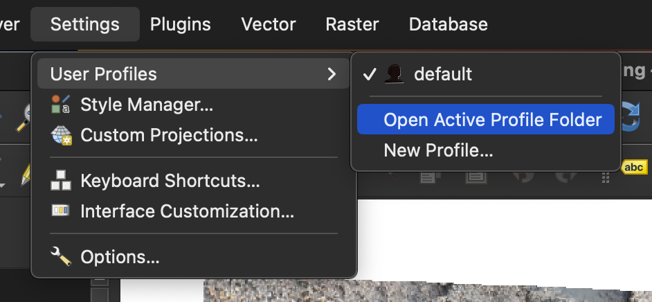
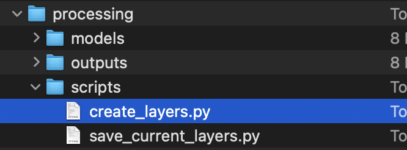
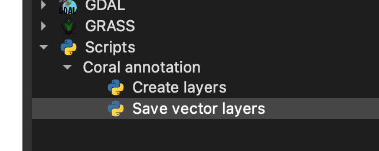

# Convinience scripts for annotation

This repository contains some simple QGIS python scripts to make coral annotation easier. Mainly, these scripts aim to automate the following tasks:

- Creating a bunch of temporary polygon scratch layers with a predefined set of common names (like overgrowth, rings (R0...Rn), uncertain, etc).
- Saving all the vector layers (after annotation) to an `annotations/` folder in the project root. This was quite a time consuming step to do manually.

## Installation

1. Download the repository folder:
2. Open QGIS (3+). Go to `Settings` > `User Profiles` > `Open Active Profile Folder`
   

3. In your file explorer, navigate to `processing`>`scripts`. This should be an empty folder, and this is where we put our custom python scripts.
4. Copy the two python files from the `scripts/` directory of this repository, that you downloaded earlier, and paste it into the current folder. Your folder should now look like this:
   
5. Resart QGIS and open the Processing toolbox (In the menu bar, `Processing`>`Toolbox`). You should now be able to see the custom scripts in the `Scripts` subsection, under `Coral annotation`.
   
6. Double click on each script to view it's configuration options and click `Run` to run it.

#### Why create temporary scratch layers at first instead of permananent ones?

This is so that you can freely rename layers before saving them. Renaming can happen if for example, you spot another ring before the ring you are currently annotating, in which case you'd rename subsequent rings. If you save the layers first, the file name wont change when you rename the layer, just the layer name would change in QGIS. Since it is preferred that the layers and files both have the same name, we might as well save the layers after annotation to a file of the same name, which is what the script does
